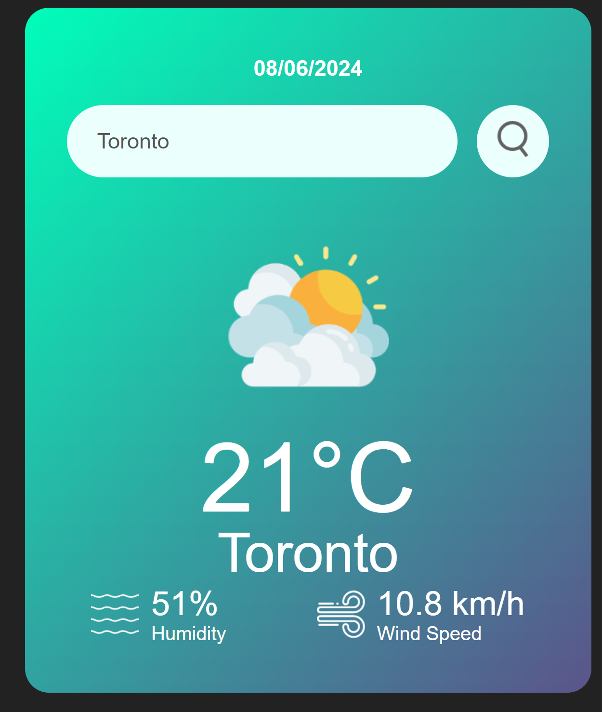

# WEATHER APP

This is a weather app that gets you the weather at a particular location

## How to Use

In the input bar enter the name of the city you want to see the weather then click the search Icon

In the output you get the following

- Weather Icon
- Temperature
- Humidity
- Wind

## Tech Stack
- Html, Css, Javascript
## API's Used

[Open Weather APIs](https://openweathermap.org/)

https://openweathermap.org/current

### API Info

- Method: `GET`
- URL: `https://api.openweathermap.org/data/2.5/weather?q={CITY_NAME}&appid={API_KEY}&units=metric`
